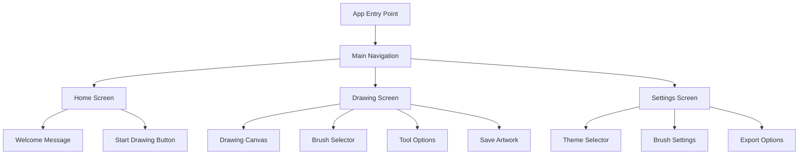

# Page 1

### Explanation:

- **App Entry Point (A)**: This is where the app starts, typically in `App.js`.
- **Main Navigation (B)**: Handles the navigation between different screens, using something like React Navigation.
- **Home Screen (C)**: The initial screen users see, with options to start drawing or access settings.
- **Drawing Screen (D)**: The core screen where users interact with the drawing canvas and tools.
- **Settings Screen (E)**: Where users can customize app settings like themes and brush preferences.
- **Components**:
  - **Welcome Message (F)**: A greeting or introduction on the Home Screen.
  - **Start Drawing Button (G)**: Button to navigate from the Home Screen to the Drawing Screen.
  - **Drawing Canvas (H)**: The canvas where users create their artwork.
  - **Brush Selector (I)**: A tool to choose different brushes.
  - **Tool Options (J)**: Additional drawing tools like erasers, color pickers, etc.
  - **Save Artwork (K)**: Option to save the current drawing.
  - **Theme Selector (L)**: Option to choose between different UI themes.
  - **Brush Settings (M)**: Customize brush properties like size, opacity, etc.
  - **Export Options (N)**: Options to export artwork in various formats.

You can paste this code snippet into one of your documentation pages, and it will render as a diagram explaining the structure of your Expo project.